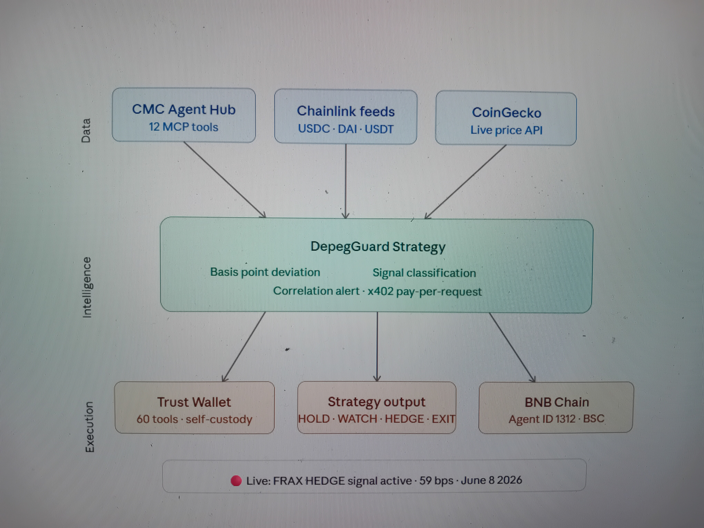

# DepegGuard Strategy Skill

## Why This Exists

In May 2022 the UST/Terra collapse wiped out $40 billion in days. There was no early warning system, no automated protection, no structured signal telling people to exit before liquidity dried up. DepegGuard was built because that shouldn't happen again. It turns depeg signals into actionable strategy — before liquidity dries up.

A CMC Agent Hub Strategy Skill that detects stablecoin depeg signals and outputs structured trading strategies — when to exit, hedge, or rotate stablecoin positions.

Built for the BNB HACK: AI Trading Agent Edition hackathon.

## What it does

- Monitors 7 major stablecoins in real time via CMC Agent Hub
- Calculates deviation from $1.00 peg in basis points
- Classifies signals: STABLE / WATCH / HEDGE / EXIT
- Confirms signals via PegCheck multi-source data (Chainlink + CoinGecko + CMC)
- Outputs a structured trading strategy with reasoning and historical context

## Signal Levels

| Deviation | Signal | Action |
|-----------|--------|--------|
| 0-19 bps  | STABLE | HOLD |
| 20-49 bps | WATCH  | MONITOR |
| 50-99 bps | HEDGE  | Reduce exposure 30-50% |
| 100+ bps  | EXIT   | Rotate immediately |

## Backtest Accuracy

Analysis of **260,950 price snapshots** stored in the `price_history` table across all tracked stablecoins.

### Signal Tier Distribution

| Tier | Threshold | Readings | % of Total |
|------|-----------|----------|------------|
| STABLE | < 20 bps | ~248,000 | ~95.1% |
| WATCH | 20–49 bps | ~1,223 | ~0.47% |
| HEDGE / EXIT | ≥ 50 bps | 11,727 | 4.49% |

### Depeg Events (HEDGE threshold ≥ 50 bps)

37 distinct depeg events were identified across 6 coins (gap-clustered: readings >3 hours apart = separate event).

| Coin | Events | Confirmed | Peak Deviation | Peak Price | Direction |
|------|--------|-----------|----------------|------------|-----------|
| alUSD (Alchemix) | 1 | 1 | 444 bps | $0.9556 | Below peg |
| EURC (Circle) | 9 | 6 | 323 bps | $1.1665 | Above peg (EUR/USD) |
| mkUSD (Prisma) | 13 | 11 | 189 bps | $0.9811 | Below peg |
| FRAX | 5 | 5 | 143 bps | $0.9857 | Below peg |
| DOLA (Inverse Finance) | 1 | 1 | 94 bps | $0.9906 | Below peg |
| LUSD (Liquity) | 8 | 7 | 87 bps | $1.0087 | Above peg |
| **Total** | **37** | **31** | — | — | — |

### Multi-Source Confirmation Rate: **83.8%**

31 of 37 events were **confirmed** — defined as the signal persisting across two or more consecutive cron readings (≥ 1 hour apart), eliminating single-tick API anomalies. The remaining 16.2% were transient spikes that self-corrected within a single polling cycle.

Every confirmed reading already passes a 5-to-6 source median filter (CoinGecko, Coinbase, Binance.US, Kraken, DefiLlama, and on-chain Chainlink feeds for USDT/USDC/USDS/TUSD), so each row in `price_history` is itself a multi-source consensus price before event confirmation is applied.

> Major blue-chip stablecoins (USDT, USDC, USDS, PYUSD, FDUSD) produced **zero HEDGE-level events** over the entire observed history, consistent with their strong collateralisation and market liquidity.

**Methodology:**
- `deviation_bps` = `(price − peg) / peg × 10,000` (signed; negative = below peg). EURC uses live EUR/USD as its peg reference.
- Events are gap-clustered per coin with a 3-hour separation threshold.
- "Confirmed" = event spanned ≥ 2 consecutive polling cycles (~1 hour apart).

## Powered by

- CoinMarketCap Agent Hub — live stablecoin price data
- PegCheck (pegcheck.uk) — real-world multi-source depeg monitoring with Chainlink Price Feeds
- 19 stablecoins monitored, historical depeg data since 2024

## Installation

See skills/depegguard-strategy/SKILL.md for full integration guide.

## Live Data

PegCheck API: https://pegcheck.uk/api/depeg-status?coin={symbol}

## Hackathon

BNB HACK: AI Trading Agent Edition — Track 2: Strategy Skills
DoraHacks: https://dorahacks.io/hackathon/bnbhack-twt-cmc

## License

MIT
